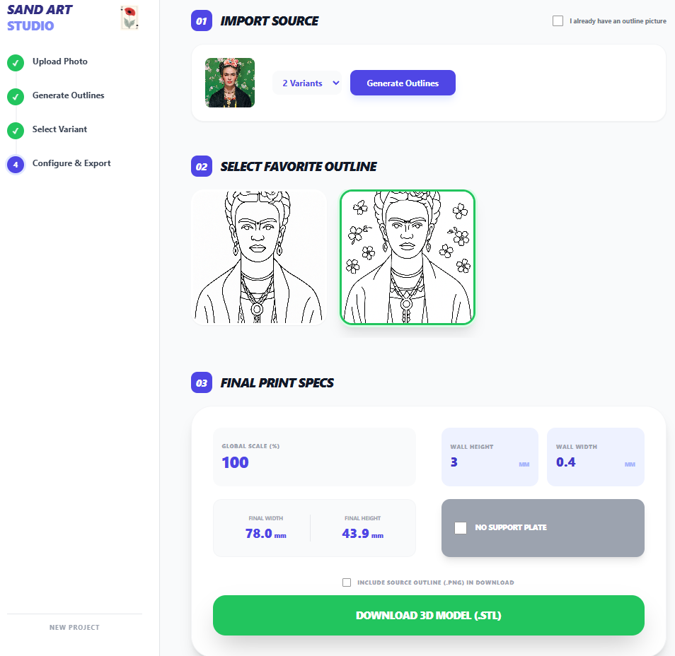

# Picture to STL Extrudation

Convert photos into printable coloring-book style 3D STL files.

This app:
1. Lets the user upload an image  
2. Uses AI + image processing to extract outlines  
3. Generates a 3D extruded STL  
4. Lets the user download the ready-to-print file

Designed for **personal use** and **fully automated**, with only a few clicks needed.


<p align="center">
  
</p>

---

## Context

Goal: help a child print custom 3D plates that can be colored like a coloring book.

The idea:
- Upload a picture
- Automatically extract main shapes
- Extrude outlines in 3D
- Download and print on any generic 3D printer

Core constraints:
- Online only
- Minimal UI
- Fully automated defaults
- Outputs generic STL files
- Reasonable validation for printability
- Default wall height: **3 mm**
- Optionally add a base plate

---

## Manual Workflow (Current Reality)

### Steps
1. Find or take photo  
2. Manually edit outlines in an image editor  
3. Convert image to vectors  
4. Import into CAD  
5. Extrude everything  
6. Export STL  
7. Fix printing issues manually  

### Pain Points
- Too many tools involved
- Takes time
- Easy to make mistakes
- Requires technical knowledge

### Nice Points
- Full control
- Can tweak everything
- Prints usually succeed after adjustments

---

## Target User Workflow (With App)

### Goal
Upload → Choose output → Download STL.

### UX Flow
1. Drop/upload image
2. App previews simplified outlines
3. Choose:
   - 1 / 2 / 4 image layout
   - Base plate on/off
   - Height (default 3 mm)
4. Click **Generate**
5. Download STL

Everything else is automated.

---

## High-Level Architecture

Single-page app running via Docker, with:

- **Frontend** (React + Vite)
- **Backend** (FastAPI Python)
- **AI / Processing Pipeline**
  - Outline extraction
  - Vector simplification
  - STL generation
- **GPT Integration**
  - Prompt tuning for simplification instructions
- **Storage**
  - Temporary files only

---

## Request Flow

### 1. Frontend → Backend
User uploads image and options.

```
POST /api/generate
```

Payload:
- image
- outline mode
- number of pictures 1 / 2 / 4
- height
- add base or not

### 2. Backend Processing
- Save image
- Call GPT for simplification rules
- Run OpenCV / vectorization
- Build STL via mesh library
- Validate geometry
- Return STL file path

### 3. Frontend
Offers file download.

---

## Project Structure

Project root:

```
.
├── README.md
├── docker-compose.yml
├── .env
├── .gitignore
├── backend
│   ├── Dockerfile
│   ├── requirements.txt
│   ├── config.py
│   ├── app
│   │   ├── __init__.py
│   │   ├── main.py
│   │   ├── services
│   │   │   ├── __init__.py
│   │   │   ├── gpt_client.py
│   │   │   ├── image_pipeline.py
│   │   │   └── generate_stl_from_image.py
│   │   ├── static
│   │   └── temp
├── frontend
│   ├── Dockerfile
│   ├── package.json
│   ├── vite.config.js
│   ├── index.html
│   └── src
│       ├── App.jsx
│       ├── api.js
│       ├── main.jsx
│       ├── components
│       │   ├── DownloadButton.jsx
│       │   ├── Dropzone.jsx
│       │   └── OptionsPanel.jsx
│       └── public
│           └── logo.png
├── ressources
│   ├── images
│   │   ├── ...example of input portraits...
│   ├── outlines
│   │   ├── ...example of midput coloringbook version of the portraits...
│   ├── STL
│   │   ├── ...example of STL outputs...
│   ├── wholeapp.png 
```

---

## Environment Variables

Copy the template.

```
cp .env.example .env
```

Update values.

```
OPENAI_API_KEY=your_key
BACKEND_PORT=8000
FRONTEND_PORT=5173
```

---

## Run with Docker

```
docker-compose up --build
```

Then open:

```
http://localhost:5173
```

---

## Development (non-Docker)

### Backend
```
cd backend
pip install -r requirements.txt
uvicorn app.main:app --reload
```

### Frontend
```
cd frontend
npm install
npm run dev
```

---

## Roadmap

- Add print preview
- Add adjustable line thickness
- More robust STL validation
- History of generated models
- Profiles for default behaviors

---

## License

Personal use only initially. To be defined for public release.

---

## Notes

AI output is heuristic. Always visually inspect STL before printing.
